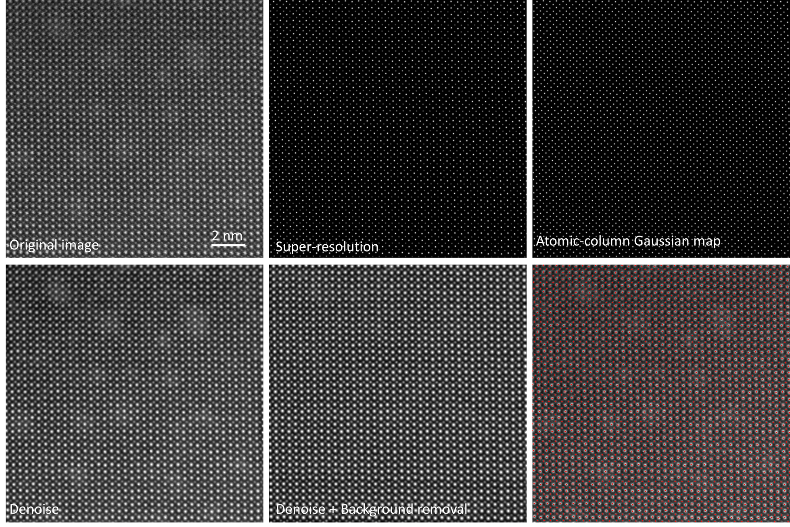
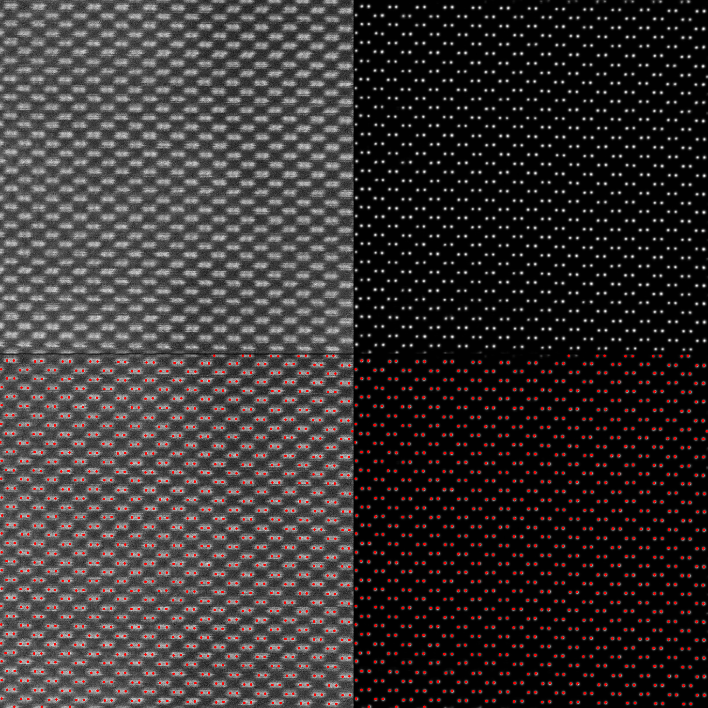
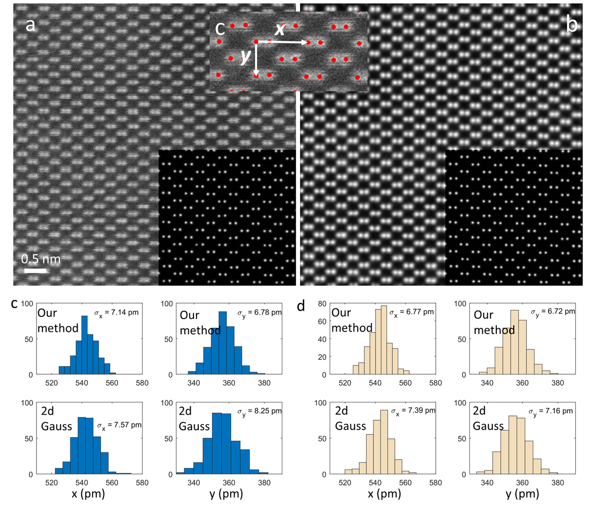

# AtomSegNet
AtomSegNet by DeepEM Lab@UCI

pytorch == 1.3.0
torchvision==0.4.0

### Running the App
```
python Code_Atom_Seg_Ui.py
```
In DOS terminal, enter
```
run
```

### Examples

<p align="left"></p>

<p align="left"></p>


### Benchmark of the precision of the atom localizer

We beat the golden standard--2d Gaussian fit
<p align="left"></p>

